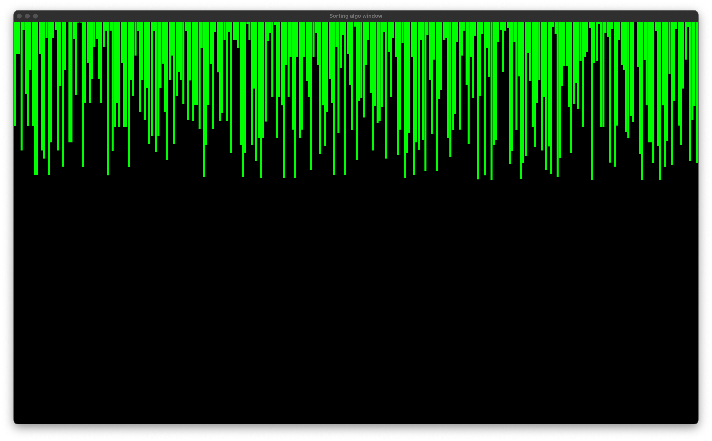
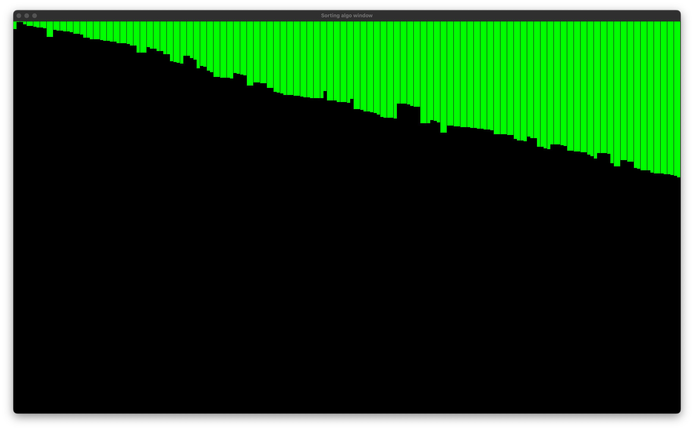

## Compiler command:

clang++ -std=c++17 main.cpp -o main -I/opt/homebrew/include -L/opt/homebrew/lib -lsfml-graphics -lsfml-window -lsfml-system

## Preview:

## Available Sorting Algorithms

| Algorithm      | Description                                                                                                                                             |
| -------------- | ------------------------------------------------------------------------------------------------------------------------------------------------------- |
| Bubble Sort    | A simple sorting algorithm that repeatedly steps through the list, compares adjacent elements and swaps them if they are in the wrong order             |
| Insertion Sort | A simple sorting algorithm that builds the final sorted array one item at a time                                                                        |
| Selection Sort | An in-place comparison sorting algorithm that divides the input list into two parts: a sorted portion and an unsorted portion                           |
| Merge Sort     | An efficient, stable, divide-and-conquer sorting algorithm that divides the unsorted list into n sublists and then merges them to produce a sorted list |
| Quick Sort     | A divide-and-conquer algorithm that picks an element as pivot and partitions the array around the pivot                                                 |
| Radix Sort     | A non-comparative sorting algorithm that sorts integers by processing each digit                                                                        |
